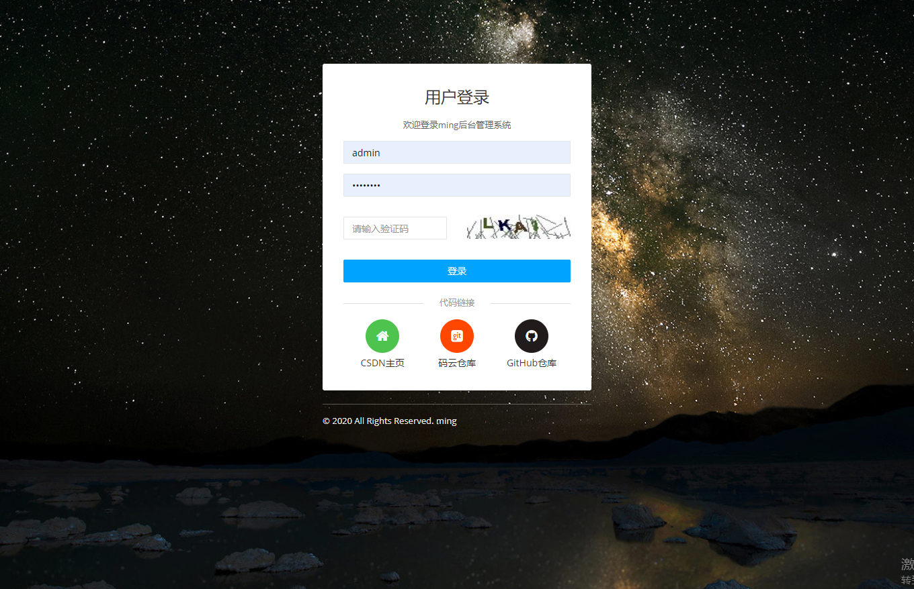
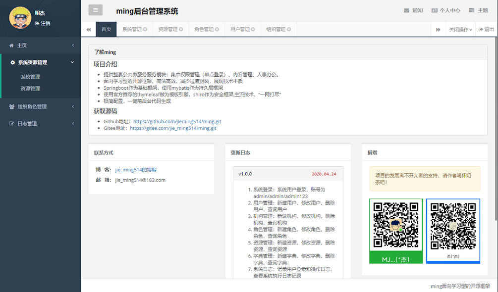
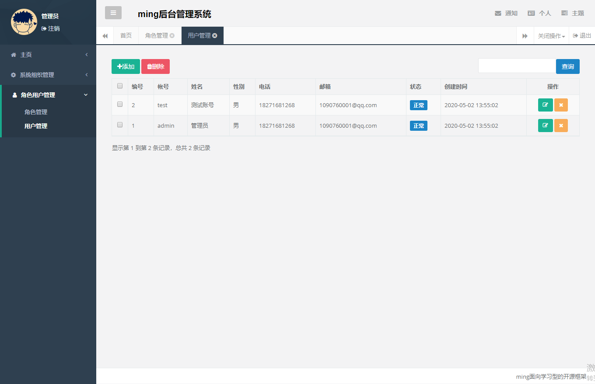
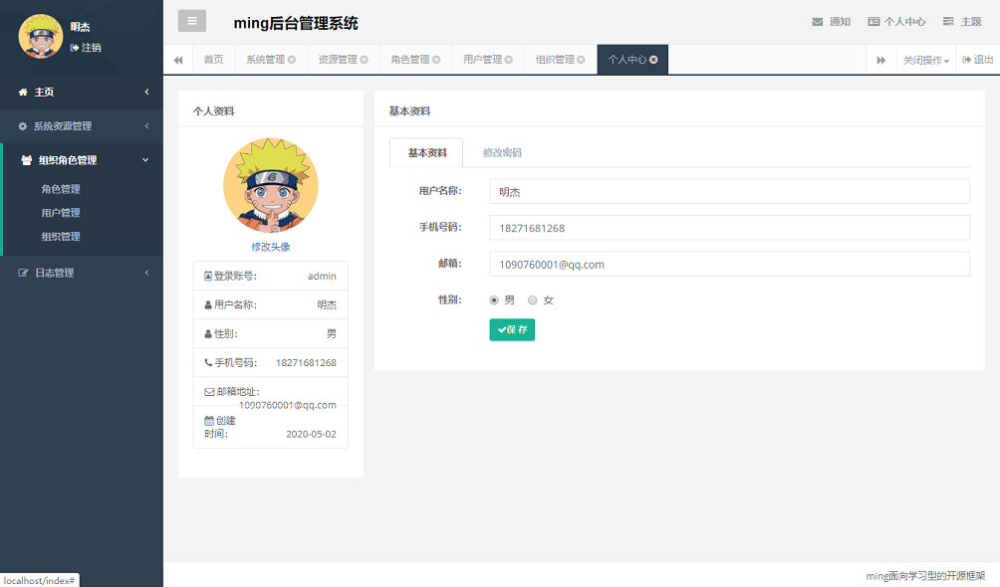
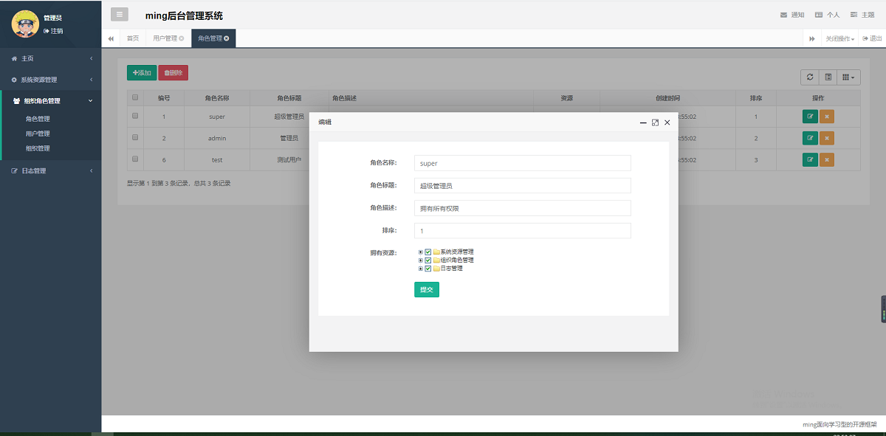
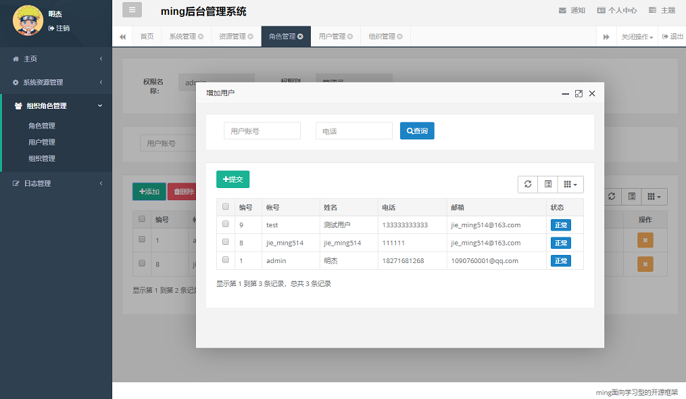
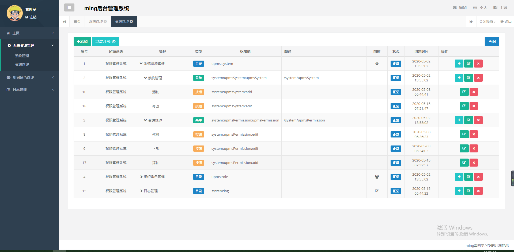
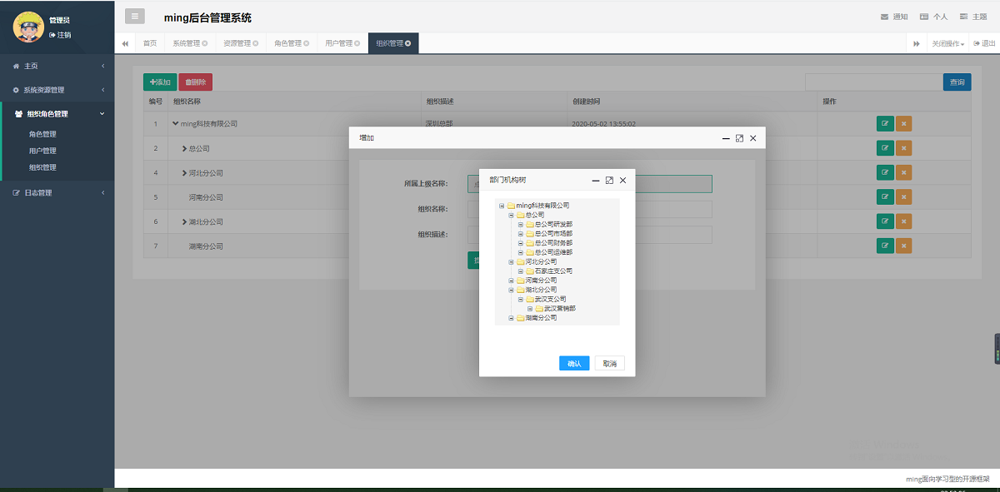
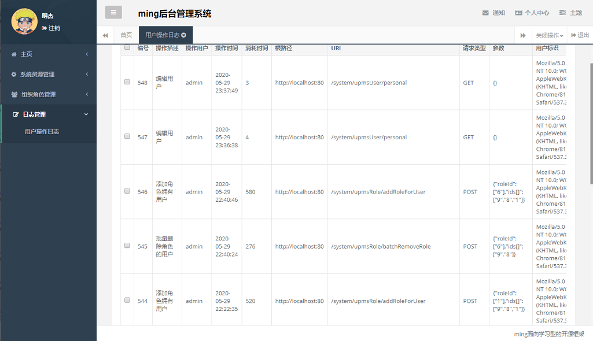

# ming

## 项目介绍

因本人姓“明”，所以以ming作为项目名；网上看到的项目大都是公共模块的项目。所以希望整合出一整套后台管理系统。

ming 项目是基于SpringBoot2的一整套后端管理平台，提供整套公共微服务服务模块：集中权限管理（单点登录）、内容管理、人事办公。旨在通过实战分享个人经验简洁高效，减少过渡封装，展现技术本质,以技术服务于业务。

## 项目模块

### 1. 项目功能

#### 用户管理系统功能（UPMS）

  - 系统登录：系统用户登录，账号为admin/admin/admin123
  - 用户管理：新建用户，修改用户，删除用户，查询用户
  - 机构管理：新建机构，修改机构，删除机构，查询机构
  - 角色管理：新建角色，修改角色，删除角色，查询角色
  - 资源管理：新建资源，修改资源，删除资源，查询资源
  - 字典管理：新建字典，修改字典，删除字典，查询字典
  - 系统日志：记录用户登录和操作日志，查看系统执行日志记录
  - 代码生成：提供代码生成器，最大化的降低代码开发量
  - 主题切换：支持主题切换，自定主题颜色，一键换肤
  
#### 内容管理系统功能（CMS）
  - 未开始

#### 人事办公管理系统功能（OA）
  - 未开始

## 技术说明

### 1.后端技术

| 技术 | 版本 | 说明 | 官网 |
|:--- | --- | :---| :---|
| spring-boot | 2.3.4 | 核心框架 | https://start.spring.io/ |
| Apache Shiro | 1.4.2 | 安全框架 | http://shiro.apache.org/ |
| MyBatis | 1.3.2 | 持久层框架 | http://mybatis.org/ |
| PageHelper | 1.2.5 | MyBatis物理分页插件 | http://git.oschina.net/free/Mybatis_PageHelper |
| Alibaba Druid | 1.1.14 | 数据库连接池 | https://druid.apache.org/
| Thymeleaf | 2.0.0 | 模板引擎 | https://www.thymeleaf.org/ |
| Logback | 1.2.3 | 日志管理| http://logback.qos.ch |
| Swagger |2.9.2 | API接口文档页面 | https://swagger.io/ |
| Velocity | 1.7 | 模板引擎 | http://velocity.apache.org/ |

### 2.前端技术

  - JS框架：jQuery、BootStrap
  - 弹出层：layer
  - 树结构控件：zTree
  - 数据表格：bootstrap-table

### 3.开发工具

  - MySql: 数据库
  - Tomcat: 应用服务器
  - Git: 版本管理
  - IntelliJ IDEA: 开发IDE
  - MySQLWorkbench: 数据库客户端

### 4.规范约束

  - 参考[阿里巴巴Java开发手册]

## 部署说明

### 1.运行环境

  - Jdk8+
  - Mysql5.5+

### 2.部署说明

#### 运行前准备工作

  1. 新建ming数据库，导入database文件夹下的 `ming-ddl.sql`和 `ming-dml.sql`。
  2. 修改 `application.yml` 文件中的mysql数据库的用户名和密码。
  
#### 启动

  - 打开`ming-admin`模块下的 `com.ming.MingAdminApplication` 类的 main() 方法进行启动。

#### 登录

> 测试账号：admin/admin123

## 系统演示截图

|   |   |
|  ----  | ----  |
|  |  |
|  |  |
|  ||
|  |  |

## 参与开发

> 首先谢谢大家支持，如果你希望参与开发，欢迎通过Github上fork本项目，并Pull Request您的commit。

## 其他相关

### 1. ming 相关博客
  - CSDN博客：[jie_ming514的博客](https://blog.csdn.net/m1090760001)

### 2. 联系方式

> 邮箱: jie_ming514@163.com

## 捐赠

> 项目的发展离不开大家的支持，请作者喝杯奶茶吧！

